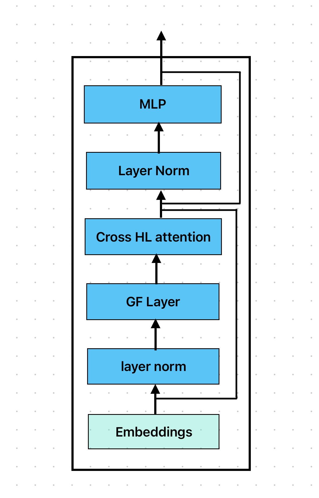
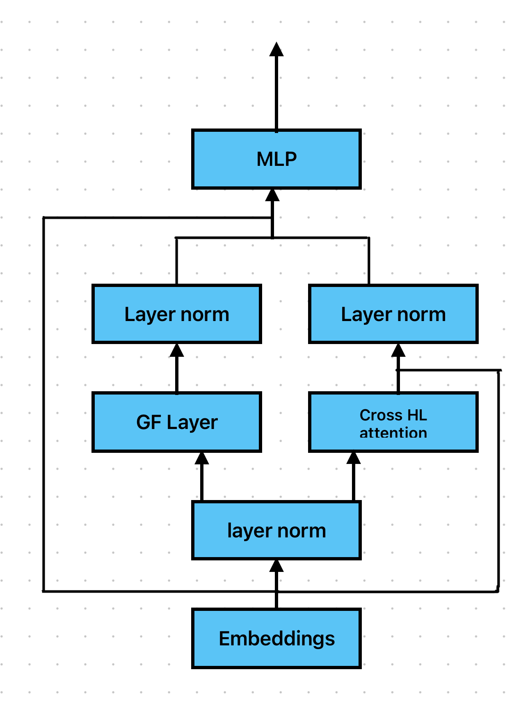
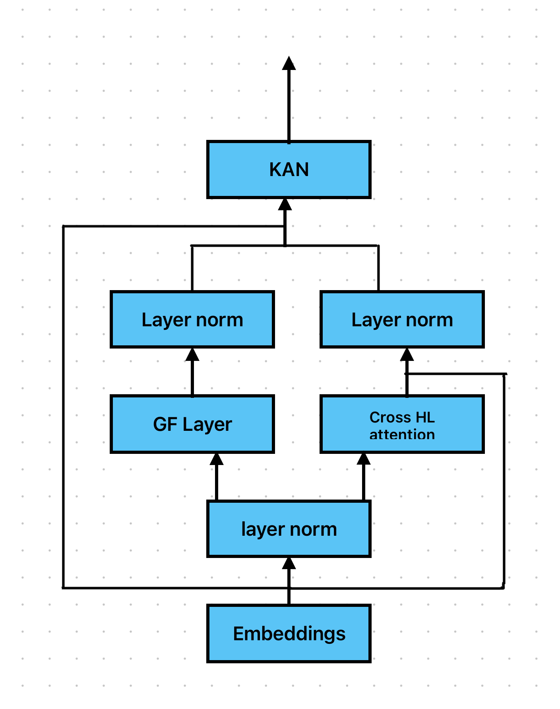

# Transformers for Hyperspectral Image Classification

Hybrid Conv3D + Transformer architectures for hyperspectral image (HSI) classification, combining Global Filter Networks (GFNet) with Cross-HL attention mechanisms. Built and evaluated on the Trento and Houston benchmark datasets using HSI + LiDAR multimodal fusion.

## Key Results

### Ablation Study (Overall Accuracy %)

| Model | Trento | Houston |
|---|---|---|
| GFNet only | 84.9 | 55.0 |
| CrossHL (no CLS token) | 97.4 | 84.54 |
| **GFNet + CrossHL Parallel (no CLS)** | **98.12** | **81.45** |

### KAN Variants (Trento, Overall Accuracy %)

| Model | OA |
|---|---|
| CrossHL + KAN (no CLS) | ~96.1 |
| CrossHL + GFNet + KAN (no CLS) | ~92.6 |
| CrossHL + CLS + KAN | ~97.1 |

The best configuration is the parallel GFNet + CrossHL architecture without CLS token, achieving **98.12% on Trento** and outperforming CNN baselines by 12%.

## Architecture Variants

Three encoder block designs were explored, each integrating the Global Filter Network and Cross-HL attention differently:

### Series
GF Layer and Cross-HL attention applied sequentially within each encoder block.



### Parallel (Best)
GF Layer and Cross-HL attention applied in parallel branches, outputs merged before the MLP.



### KAN
Same parallel structure as above, but replaces the MLP with a Kolmogorov-Arnold Network (KAN) using learnable B-spline activation functions.



## Repository Structure

```
.
├── models/
│   ├── base/
│   │   ├── gfnet.py                 # Global Filter Network (base implementation)
│   │   └── crosshl_model.py         # CrossHL Transformer (base, series GF integration)
│   ├── crosshl_gf_series.py         # GF + CrossHL series variant
│   └── crosshl_gf_kan.py            # GF + CrossHL + KAN (parallel, with training code)
├── notebooks/
│   └── crosshl_gf_parallel.ipynb    # GF + CrossHL parallel variant (best model)
├── data/
│   └── trento/                      # Trento dataset (.mat files)
├── figures/                         # Architecture diagrams
├── results/                         # Handwritten ablation results
├── requirements.txt
└── README.md
```

## Model Details

**Input**: Hyperspectral image patches (11x11) + LiDAR data, loaded as `.mat` files.

**Pipeline**:
1. 3D convolution (Conv3D) extracts spectral features from HSI patches
2. HetConv (heterogeneous convolution) combines groupwise + pointwise convolutions
3. Transformer encoder with Cross-HL attention fuses HSI and LiDAR modalities
4. Global Filter Network applies frequency-domain filtering via FFT
5. Classification head outputs land cover predictions

**Training config**: AdamW, lr=5e-4, weight_decay=5e-3, StepLR (step=50, gamma=0.9), batch_size=64, CrossEntropyLoss.

## Datasets

- **Trento**: 6 land cover classes (Buildings, Woods, Roads, Apples, Ground, Vineyard), 63 HSI bands + 1 LiDAR band
- **Houston**: 15 land cover classes, 144 HSI bands + 1 LiDAR band

Datasets are expected as `.mat` files with separate train/test splits for HSI, LiDAR, and labels.

## Setup

```bash
git clone https://github.com/dikshitrishii/Transformers-Implementation-On-Hyperspectral-Images.git
cd Transformers-Implementation-On-Hyperspectral-Images
pip install -r requirements.txt
```

## References

- [GFNet: Global Filter Networks for Visual Recognition](https://arxiv.org/abs/2107.00645)
- [CrossHL: Cross-modal Hyperspectral and LiDAR Transformer](https://ieeexplore.ieee.org/document/9759620)
- [KAN: Kolmogorov-Arnold Networks](https://arxiv.org/abs/2404.19756)

## License

MIT
